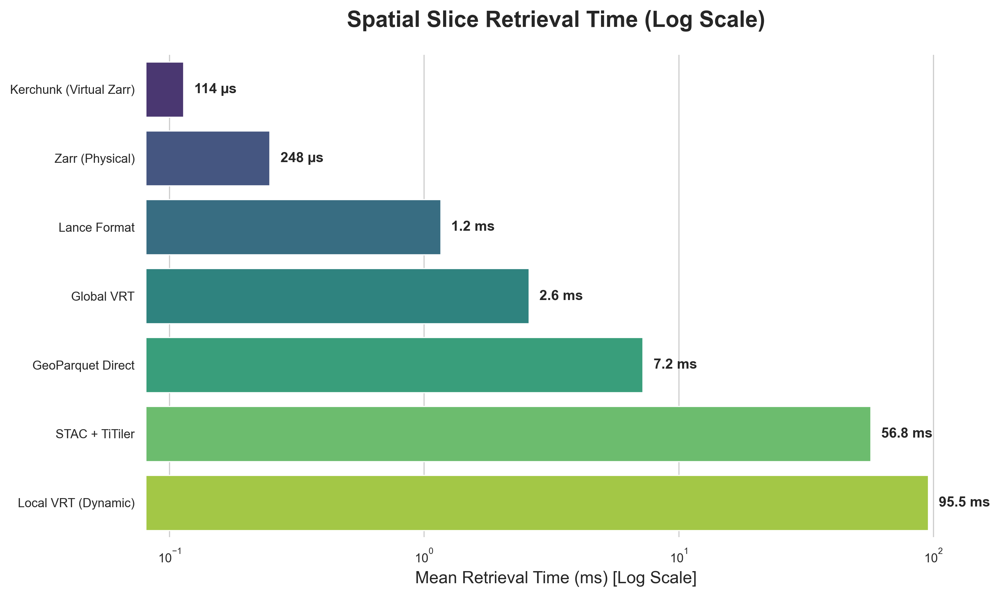

## The Problem: The VRT Bottleneck

When dealing with massive geospatial datasets—like global 30m resolution DEMs or climate hazard models spanning multiple scenarios and decades—data providers naturally partition their rasters into thousands or millions of Cloud Optimized GeoTIFFs (COGs). 

The classic GDAL ecosystem approach to querying across these partitioned files is to build a Virtual Raster (VRT). A VRT is essentially an XML file that maps a spatial grid to the underlying COGs. You open the VRT in `rasterio` or `gdal`, give it a bounding box, and it figures out which files to read.

But there's a fatal flaw when scaling this to the globe: **VRTs are giant XML files.**

If you have 10 million COGs, your VRT becomes a multi-gigabyte XML file. When your Python worker tries to open it to read a single bounding box, it must parse that entire XML structure into memory. This leads to massive RAM spikes, high latency, and eventual OOM (Out of Memory) crashes. 

<Callout type="info">
**TL;DR:** Global VRTs break down at scale due to XML parsing overhead. For production systems serving "busy tiles", physically rewriting your data to **Zarr v3 Sharded Archives** or using modern tabular formats like **Lance** provides sub-millisecond retrieval times.
</Callout>

## The Alternatives

If Global VRTs won't scale, how do we query a massive collection of COGs efficiently? We benchmarked 5 alternative architectures against the traditional Global VRT:

1. **Local VRTs (Dynamic):** Instead of one giant VRT, we use a lightweight spatial index (like GeoParquet) to find intersecting COGs, and dynamically build a tiny, in-memory `/vsimem/` VRT at query time.
2. **GeoParquet Direct Reads:** Similar to Local VRTs, but we skip the VRT entirely. We find the intersecting COGs using GeoParquet, open them directly with `rasterio`, and use `rasterio.merge` to mosaic them in memory.
3. **Kerchunk (Virtual Zarr):** We extract the byte-offsets of the compressed TIFF chunks and store them in a lightweight JSON index. Clients read this index using `fsspec`'s `ReferenceFileSystem` and `xarray/zarr`, treating the original COGs as a single Zarr array without moving any data.
4. **Lance Format:** A modern columnar format built for ML and multimodal data. We extract the TIFF data into `FixedSizeListArrays` alongside WKB geometries. Lance provides $O(1)$ random access, avoiding the decompression of entire row groups.
5. **Zarr v3 (Physical):** We bite the bullet and physically rewrite the COGs into a native **Zarr v3 Sharded Archive**. 
6. **STAC + TiTiler:** We rely on a dynamic map server backend (TiTiler) and a STAC catalog, simulating the network and compute overhead of requesting a dynamic mosaic over an API.

## The Benchmark: Wall-Clock Retrieval

We built a Python harness using `pytest-benchmark` to test these 6 architectures. The task: retrieve a spatial slice intersecting 4 mock COGs out of a grid.

Here are the empirical wall-clock results running our python harness:



```text
---------------------------------------------------------------------------------------------------------------------------
Name (time in us)                        Min                     Max                   Mean                StdDev            Rounds
---------------------------------------------------------------------------------------------------------------------------
test_bench_kerchunk                        106.1669               155.5410             113.6704            8.3523           164
test_bench_zarr                            222.5830               622.0831             247.8913           40.5741           97
test_bench_lance                           815.3339              2365.5839            1162.5090          348.1033           60
test_bench_global_vrt                     2482.9170              2789.8330            2579.0237           53.8033           121
test_bench_geoparquet_direct              6942.8330              7975.9581            7235.8643          239.7084           101
test_bench_titiler                       53447.7500             59086.5840           56802.7672         1504.1333           17
test_bench_local_vrt                     94853.6251             96684.6250           95457.9406          667.1794           7
---------------------------------------------------------------------------------------------------------------------------
```

### Analyzing the Results

- **The Winners (Kerchunk & Zarr):** Both the virtual and physical Zarr approaches completely bypass the overhead of XML parsing and dynamic mosaicking. They fetch exactly the compressed bytes needed.
- **The Surprise (Lance):** Lance's $O(1)$ random access makes it incredibly fast (~1.1ms), matching the performance of pure N-dimensional arrays while offering the schema flexibility of a tabular format.
- **The Loser (Local VRT):** Dynamically writing to `/vsimem/` and rebuilding the GDAL dataset at runtime takes nearly 100ms. It's safe on memory, but terrible for latency.

## Conclusion: The Winning Architecture

After assessing the performance and operational overhead of all approaches, a clear winner emerges for serving "busy tiles" in production.

While "virtual" zero-copy references (like Kerchunk or VirtualiZarr) are incredibly fast, they introduce brittle dependencies on external HTTP servers and require managing complex, large-scale Parquet indices alongside the raw COGs.

Instead, the most robust and performant architecture is to **physically rewrite the COGs into Zarr v3 Sharded Archives** (which can be done in parallel at lightning speeds using tools like `tensorstore` or Rust's `zarrs`). 

Once the data is physically packaged as a native Zarr v3 archive, we can completely bypass slow backend Python tile servers. By hosting the Zarr archive directly on a static cloud bucket (like S3) and using **`zarr-layer` with MapLibre** on the frontend, the browser will dynamically fetch the binary chunks it needs and render them instantly on the GPU via client-side rendering.

This architecture eliminates the VRT bottleneck, removes the need for expensive backend tile servers, and provides the absolute lowest latency for interactive web maps.
